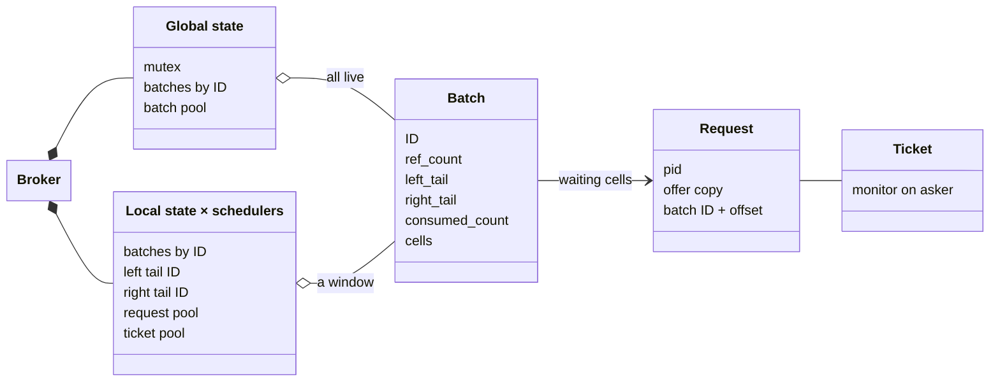
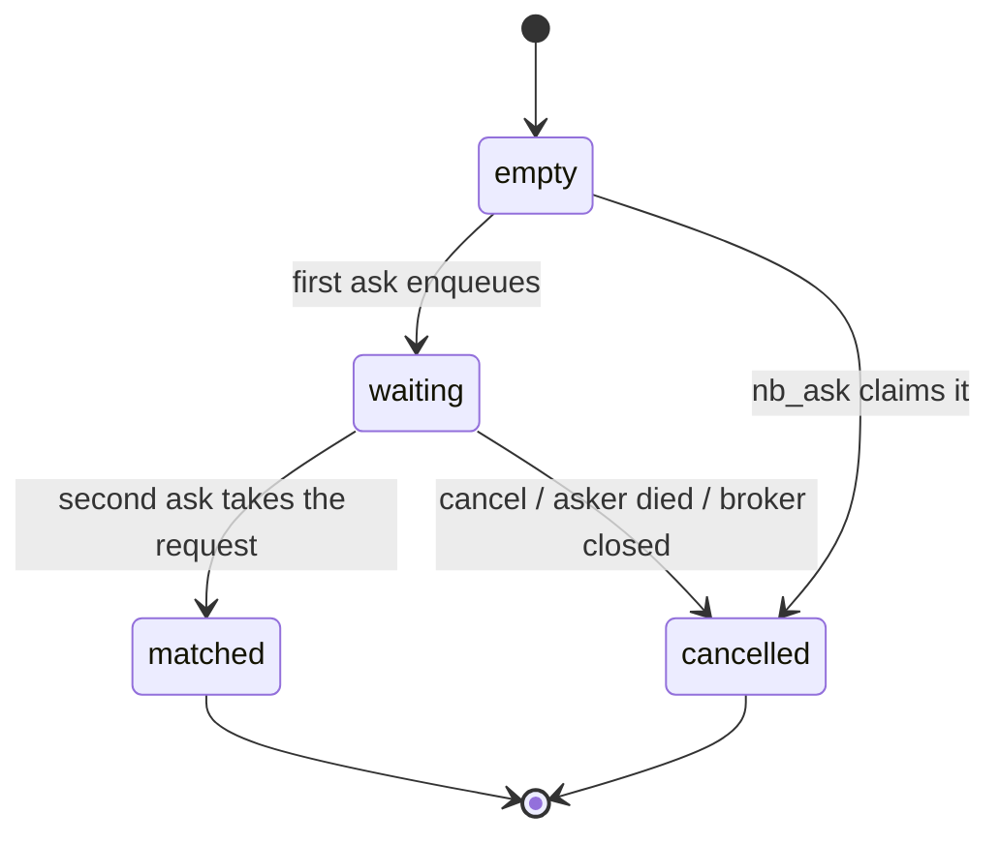
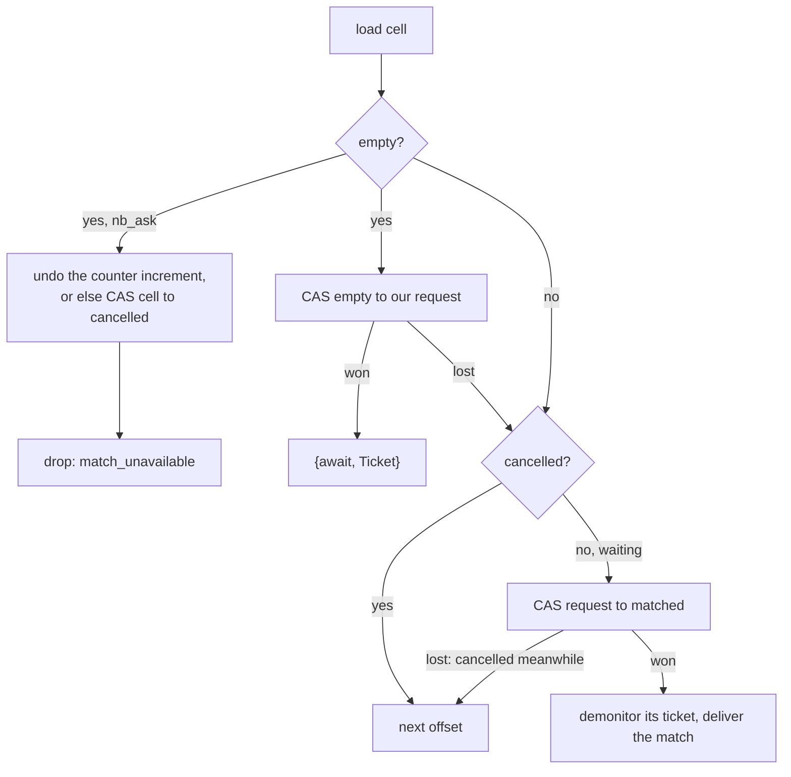

# Internals

How the NIF (`c_src/cbroker_nif.c`) matches offers without a broker process.

## Glossary

- **Lane**: `left` or `right`. An ask matches only offers from the other lane.
- **Offer**: the term an ask brings, copied into the broker if it has to wait.
- **Cell**: one atomic pointer slot, where one ask of each lane meets.
- **Batch**: a fixed array of cells (defaults to 32x the number of schedulers),
  identified by an ever-increasing ID.
- **Request**: a waiting ask: its pid, a copy of its offer, and its cell's location.
- **Ticket**: a resource that monitors the asker and points to its request. It
  is the `Ticket` in `{await, Ticket}`.
- **Local state**: per-scheduler view of the broker. Only its scheduler touches it,
  so it takes no lock.
- **Global state**: the mutex-guarded list of live batches.
- **Credits**: how many cells one NIF call may try before yielding.
- **Sojourn time**: nanoseconds since the ask started.

## Structure

Batches form a sequence. The global state holds all of it; each local state
holds a window, from its oldest tail to the newest batch it has checked out.
For example (L and R mark each scheduler's tails):

| Batch ID    | 7 | 8 | 9 | 10 |
|-------------|---|---|---|----|
| Global      | ● | ● | ● | ●  |
| Scheduler 1 |   | L | R |    |
| Scheduler 2 | R | ● | ● | L  |

Batch 7's `ref_count` is 2 (global and scheduler 2). Once scheduler 2's right
tail moves past it, it drops to 1 and the batch is recycled.

A request holds a copy of the broker term, so a broker with waiting asks
stays alive even if nobody else references it.

## Cells

A cell is of type `_Atomic(request_t*)`
([`stdatomic.h`](https://en.cppreference.com/c/header/stdatomic)). Every
transition is a
[compare-and-swap](https://en.cppreference.com/c/atomic/atomic_compare_exchange),
so exactly one party wins each cell.

`matched` and `cancelled` point to static sentinel values; only `waiting`
points to an allocation.

## Asking

1. Pick the caller's local state and its tail batch for the lane.
2. `fetch_add` the lane's counter in the batch to claim an offset. If the
   counter is past the end, the batch is full on this lane: advance (see
   [Batches](#batches)).
3. Act on the cell:

Each cell tried costs one credit, out of 400 per call. When they run out, the
NIF reschedules itself with `enif_schedule_nif`, carrying its request over in a
retry resource. After 10 retries, the ask gives up with `broker_overloaded`.

A request is allocated lazily, only when an ask tries to enqueue. If it then
loses the cell and matches instead, the counterpart's message is built in that
request's env, so the offer isn't copied twice.

### Delivering a match

The winner of the `matched` CAS owns the request. A synchronous asker gets the
counter-offer as its return value, and the counterpart gets a message. An
`async_ask` gets its reply as a message, too.

If demonitoring the counterpart fails, either it died or a concurrent
`cancel/1` demonitored first. The match proceeds either way: the concurrent
cancel call then loses the cell CAS and answers `too_late`.

When both sides are replied to by message, the `right` lane is messaged first,
so the order is predictable. `sbroker` does the same for its bids.

## Ownership

Three parties race for a waiting request: the matcher, `cancel/1`, and the
asker's DOWN callback. Two rules apply:

- **Whoever demonitors the ticket first owns the ticket.**
- **Whoever moves the cell out of `waiting` owns the request** and counts the
  cell as consumed.

| Party    | Demonitor      | Cell CAS                   | Result                          |
|----------|----------------|----------------------------|---------------------------------|
| matcher  | after the CAS  | `waiting → matched`        | match, even if demonitor fails (dead or cancelling) |
| `cancel` | before the CAS | `waiting → cancelled`      | `{cancelled, T}`, else `too_late` |
| DOWN     | done by ERTS   | `waiting → cancelled`      | request freed, else nothing     |
| close    | before freeing | `waiting → cancelled`      | `{drop, broker_closed, T}` sent |

If `cancel/1` is called by a process other than the asker, the asker also gets
`{Tag, {drop, cancelled, T}}`.

## Batches

### Counters

- `left_tail` / `right_tail`: next offset per lane. Once at or past the end,
  the batch is full on that lane.
- `consumed_count`: cells that reached `matched` or `cancelled`. Once it reaches
  the end, the batch is spent.
- `ref_count`: one for being in the global state, one per local state holding
  it, plus one per short-lived lease (a cancel or DOWN from another scheduler).

### Lifecycle

- **Advancing.** A lane's tail moves to the next batch in the local state.
  If there is none, the global lock is taken, every unspent batch with a
  higher ID is checked out, and if there are none, a batch from the pool is
  added as ID + 1.
- **Dropping.** A local state drops a batch once both of its tails are past
  it, or when it consumes the batch's last cell.
- **Removing.** Whoever brings `ref_count` to 1 takes the lock and checks
  again. If the batch had the highest ID, it is reset and reinserted as ID + 1,
  so the global state is never empty and IDs are never reused. Otherwise it
  goes back to the batch pool (or is freed if the pool is full).

## Closing

When using the `depends_on_creator` option, the broker will close when its
creator dies. The monitor callback will then:

1. Mark the global and local states closed. New asks fail with
   `error(broker_closed)`.
2. Check out every batch, set all its counters to the end, and CAS each
   remaining cell to `cancelled`.
3. Tell each waiting asker `{drop, broker_closed, T}`.

Named brokers (`cbroker_persistent`) are created by a `gen_server` with
`depends_on_creator` forced on and kept in `persistent_term`, so the broker
closes when that server stops.

## Memory

Requests and tickets come from per-scheduler pools, and batches from the global
pool. With `COUNT_ALLOCS=1`, `cbroker_nif:alloc_counters/0` reports what is
live; see `AGENTS.md`.
