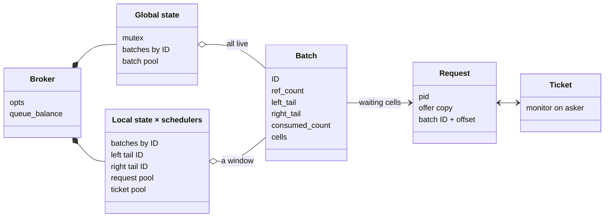
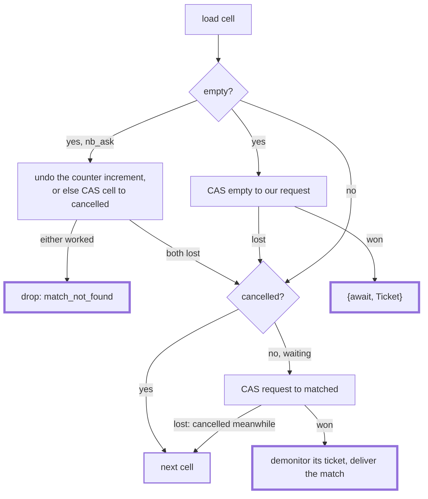
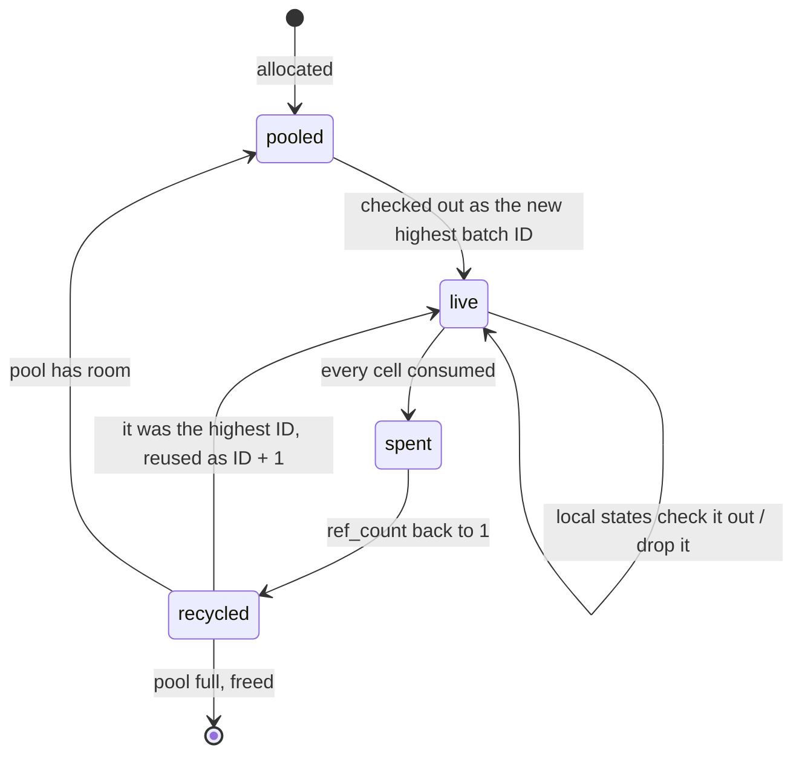

<!-- vim: set spell spelllang=en_us: -->

# Internals

How the NIF (`c_src/cbroker_nif.c`) matches offers without a broker process.

## Glossary

- **Lane**: `left` or `right`. An ask matches only offers from the other lane.
- **Offer**: the term an ask brings, copied into the broker if it is to enqueue.
- **Cell**: one atomic pointer slot, where one ask of each lane meets.
- **Batch**: a fixed array of cells (defaults to 32x the number of schedulers),
  identified by an ever-increasing ID.
- **Request**: a waiting ask: its pid, a copy of its offer, and its cell's
  location.
- **Ticket**: a resource that monitors the asker and points to its request. It
  is the `Ticket` in `{await, Ticket}`.
- **Local state**: per-scheduler view of the broker. Only its scheduler touches
  it, so it takes no lock.
- **Global state**: the mutex-guarded sequence of live batches.
- **Credits**: how many cells one NIF call may try before yielding.
- **Queue balance**: the difference in requests between the left and right
  lanes.
- **Sojourn time**: nanoseconds elapsed since an ask started.

## Index

- [**Cells**](#cells)
  - [**Asking**](#asking)
  - [**Delivering a match**](#delivering-a-match)
  - [**Request ownership**](#request-ownership)
- [**Batches**](#batches)
  - [**Counters**](#counters)
  - [**Lifecycle**](#lifecycle)
- [**Broker options**](#broker-options)
- [**Closing a broker**](#closing-a-broker)

## Structure

The global state holds the whole batch sequence. Each local state holds a
window, from its oldest tail to the newest batch it has checked out. For example
(L and R mark each scheduler's tails):

| Batch ID    | 7   | 8   | 9   | 10  |
| ----------- | --- | --- | --- | --- |
| Global      | ●   | ●   | ●   | ●   |
| Scheduler 1 |     | L   | R   |     |
| Scheduler 2 | R   | ●   | ●   | L   |

Tails drift apart when one lane has more asks than the other, or when a
scheduler hasn't asked on a lane for a while.

In the example above, batch 7's `ref_count` is 2 (global and scheduler 2). It
drops to 1, and the batch is recycled, once scheduler 2's right tail moves past
it, or once batch 7 is spent and scheduler 2's left tail advances again (see
[Dropping](#lifecycle)).

A request holds a copy of the broker term, so a broker with waiting asks stays
alive even if nobody else references it.

## Cells

A cell is of type `_Atomic(request_t*)`
([`stdatomic.h`](https://en.cppreference.com/c/header/stdatomic)). Every
transition is a
[compare-and-swap](https://en.cppreference.com/c/atomic/atomic_compare_exchange),
so exactly one party wins each cell.

`matched` and `cancelled` point to static sentinel values; only `waiting` points
to an allocation.

### Asking

1. Add either -1 or +1 to the queue balance, depending on the lane. If that
   crosses a limit, revert the increment and drop with reason `full_lane` (see
   [Queue limits](README.md#queue-limits)).
2. Pick the caller's local state and its tail batch for the lane.
3. `fetch_add` the lane's counter in the batch to claim an offset. If the
   counter is past the end, the batch is full on this lane: advance (see
   [Batches](#batches)).
4. Act on the cell:

Each cell tried costs one credit, out of a limit per call (400 by default). When
they run out, the NIF reschedules itself with `enif_schedule_nif`, carrying the
request in a retry resource. Once up to N calls have run out without a match (10
by default), the ask returns `{drop, too_many_tries, _}`.

An `async_ask` that is dropped (`full_lane`, `too_many_tries`) still returns
`{await, Tag}`, and gets the drop as a message, like any other reply.

A request is allocated lazily when an ask tries to enqueue. If it then loses the
cell and matches instead, the counterpart's message is built in that request's
env, so that the offer isn't copied twice.

### Delivering a match

The winner of the `matched` CAS owns the request. A synchronous asker gets the
counter-offer as its return value, and the counterpart gets a message. An
`async_ask` gets its reply as a message, too.

If demonitoring the counterpart fails, either it died or a concurrent `cancel/1`
demonitored first. The match proceeds either way: the concurrent cancel call
then loses the cell CAS and answers `too_late`.

When both sides are replied to by message, the `right` lane is messaged first,
so the order is predictable. `sbroker` does the same for its bids (`ask_r`).

### Request ownership

Four parties may race for a waiting request:

- the matcher on the opposite lane;
- `cancel/1`;
- the asker's DOWN callback;
- the broker's DOWN callback (which closes the broker).

When there's a conflict, two rules settle it:

- **whoever demonitors the ticket first**, owns it;
- **whoever moves the cell out of `waiting`** owns the request, counts the cell
  as consumed, and takes the request out of the queue balance.

| Party    | Demonitor when? | Cell CAS              | Result                                              |
| -------- | --------------- | --------------------- | --------------------------------------------------- |
| matcher  | after the CAS   | `waiting → matched`   | match, even if demonitor fails (dead or cancelling) |
| `cancel` | before the CAS  | `waiting → cancelled` | `{cancelled, T}`, else `too_late`                   |
| DOWN     | --              | `waiting → cancelled` | request freed, else nothing                         |
| close    | before freeing  | `waiting → cancelled` | `{drop, closed, T}` sent                            |

If `cancel/1` is called by a process other than the asker, the asker also gets
`{Tag, {drop, cancelled, _}}`.

## Batches

### Counters

- `left_tail` / `right_tail`: next offset per lane. Once at or past the end, the
  batch is full on that lane.
- `consumed_count`: cells that reached `matched` or `cancelled`. Once it reaches
  the end, the batch is spent.
- `ref_count`: one for being in the global state, one per local state holding
  the batch, plus short-lived leases (cancel or DOWN from a scheduler whose
  local state doesn't hold the batch).

### Lifecycle

- **Advancing.** A lane's tail moves to the next batch in the local state. If
  there is none, the global lock is taken and every unspent batch with a higher
  ID is checked out, with the tail moving to the oldest of them. The newer ones
  stay in the local state, to be reached without the lock. If there are none, a
  batch from the pool is added as ID + 1.
- **Dropping.** A local state drops a batch once both of its tails are past it,
  or when it consumes the batch's last cell. Also, whenever a tail advances
  without the other tail being ahead of it, the other tail is walked forward
  past every spent batch, dropping each, until it reaches one that isn't spent.
- **Removing.** Whoever brings `ref_count` to 1 takes the lock and checks again.
  If the batch had the highest ID, it is reset and reinserted as ID + 1, so the
  global state is never empty and IDs are never reused. Otherwise it goes back
  to the batch pool (or is freed if the pool is full).

## Broker options

`cbroker:new/1` and `cbroker:child_spec/2` take a list of options:

| Option               | Default                           | Meaning                                                                 |
| -------------------- | --------------------------------- | ----------------------------------------------------------------------- |
| `depends_on_creator` | `false`                           | close the broker when its creator dies                                  |
| `max_queue_len`      | `unlimited`                       | shorthand for `min_left_balance` = -N and `max_right_balance` = N       |
| `min_left_balance`   | `unlimited`                       | how far `left` waiters may outnumber `right` ones, as a negative number |
| `max_right_balance`  | `unlimited`                       | how far `right` waiters may outnumber `left` ones                       |
| `cells_per_batch`    | 32 x schedulers                   | how many cells per batch                                                |
| `ask_credits`        | 400                               | how many cells one NIF call may try before yielding                     |
| `ask_max_tries`      | 10                                | how many NIF calls to attempt before dropping the request               |
| `batch_pool`         | `[{size, 4}, {initial_count, 1}]` | spare batches kept for reuse                                            |
| `request_pool`       | `[{size, 8}, {initial_count, 0}]` | spare requests kept for reuse, per scheduler                            |
| `ticket_pool`        | `[{size, 8}, {initial_count, 0}]` | spare tickets kept for reuse, per scheduler                             |

A pool keeps up to `size` spares, and starts with `initial_count` of them
preallocated. When options overlap, the last one wins.

## Closing a broker

When using the `depends_on_creator` option, the broker will close when its
creator dies. The monitor callback will then:

1. Mark the global and local states closed. New asks fail with `error(closed)`.
2. Check out every batch, set all its counters to the end, and CAS each
   remaining non-cancelled cell to `cancelled`.
3. Message each waiting asker with `{drop, closed, T}`.

Named brokers (`cbroker_persistent`) are created by a `gen_server` with
`depends_on_creator` set to true, and kept in `persistent_term`, so that the
broker closes when that server stops.

## Memory

Requests and tickets come from per-scheduler pools, and batches from the global
pool. With `COUNT_ALLOCS=1`, `cbroker_nif:alloc_perfcounters/0` reports what is
live; see `AGENTS.md`.
