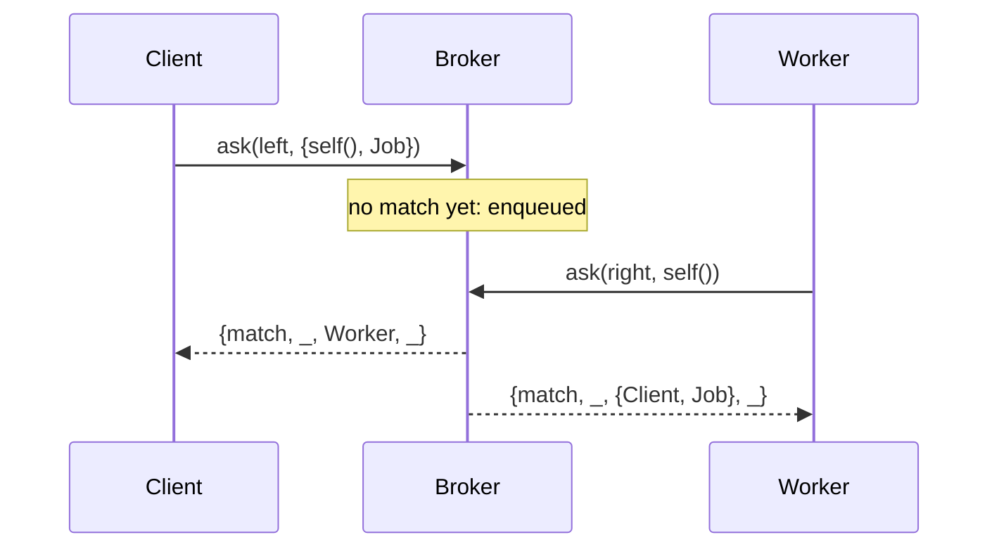

<!-- vim: set spell spelllang=en_us: -->

# cbroker

[](https://hex.pm/packages/cbroker)
[](https://github.com/g-andrade/cbroker/actions/workflows/ci.yml)
[](https://www.erlang.org)

`cbroker` provides brokers for Erlang/OTP.

Processes enqueue on either of two lanes of a broker, meet, and swap offers.
This is useful for worker pools and other producer-consumer setups.

There is no broker process: matching is done concurrently through a NIF that
uses every online ERTS scheduler.

## Goals

- **No bottleneck process**: `cbroker` contends only on a few atomic counters
  and an infrequent global lock.
- **Offers are copied concurrently**, by the processes that match them.

API semantics were inspired by [sbroker](https://hex.pm/packages/sbroker).

TODO: one benchmark figure against `cbroker_simple`.

## Installation

```erlang
{deps, [
    {cbroker, "~> 0.1"}
]}.
```

Building needs a C compiler: `cc`/`gcc` on Unix, and MSVC on Windows.

Compilation will fail on platforms in which pointer-sized atomics are not
lock-free.

## Quick start

We have a worker pool. Clients offer jobs on the `left`; workers offer
themselves on the `right`.

```erlang
worker(Pool) ->
    {match, _, {Client, Job}, _} = cbroker:ask(Pool, right, self(), infinity),
    Client ! {self(), run(Job)},
    worker(Pool).

submit(Pool, Job) ->
    case cbroker:ask(Pool, left, {self(), Job}) of
        {match, _, Worker, _} ->
            Mon = monitor(process, Worker),
            receive
                {Worker, Result} -> {ok, Result} ;
                {'DOWN', Mon, _, _, _} -> {error, worker_stopped}
            end;

        {drop, Reason, _} ->
            {error, Reason}
    end.
```



## Asking

Every offer goes on a lane (`left` or `right`) and matches one of the oldest[*]
offers on the other lane. The asking variants differ in what happens when there
isn't one yet.

- `ask`: if no match, waits up to a timeout, then cancels and returns
  `{drop, timeout, _}`.
- `async_ask`: always returns `{await, Ticket}`; the reply arrives as a message.
- `dynamic_ask`: if no match, returns `{await, Ticket}`.
- `nb_ask`: if no match, returns `{drop, match_not_found, _}`.
- `resumable_ask`: similar to `ask` but doesn't cancel upon reaching timeout,
  instead returning `{timeout, ReplyRef, Ticket}`.

Asynchronous replies arrive as `{Tag, Reply}`, where `Tag` is either the
`Ticket`, or a `ReplyRef` you passed in. The latter can be of benefit to
[optimize message reception](https://www.erlang.org/doc/system/eff_guide_processes.html#fetching-received-messages).

[*]: Requests are matched concurrently, so the exact order is not deterministic.

### Replies

- `{match, MatchRef, CounterOffer, SojournTime}`
- `{drop, Reason, SojournTime}`

General drop reasons are:

- `cancelled`: a concurrent process cancelled the request
- `closed`: the broker closed while you waited
- `full_lane`: the lane already has as many waiters as the
  [queue limits](#queue-limits) allow
- `too_many_tries`: too many cells were attempted without managing to match or
  enqueue

Specific drop reasons:

- `match_not_found`: specific to `nb_ask` - it found no match
- `timeout`: specific to `ask` - it gave up

`SojournTime` is the time spent enqueued, in nanoseconds.

### Cancelling

`cancel(Ticket)` withdraws an enqueued offer:

```erlang
case cbroker:cancel(Ticket) of
    {cancelled, _SojournTime} ->
        ok;

    too_late ->
        reply_in_process_inbox
end.
```

Additionally, the process that enqueued a request will also be monitored, and
the request cancelled if it dies before getting a match (unless these two events
happen at roughly the same time).

## Named brokers

`cbroker:new/0,1` returns a reference; the broker then lives for as long as it
is referenced.

To give it a name and a place in your supervision tree:

```erlang
Children = [cbroker:child_spec({local, my_pool})],
%% ...
cbroker:ask(my_pool, left, Job).
```

Names take the same forms as OTP process names:

- `{local, atom()}`,
- `{global, term()}`,
- or `{via, module(), term()}`.

## Queue limits

An optional limit, `max_queue_len`, may be set when you create a broker. For
each lane, it will restrict how many more pending requests it may have than the
other lane. See [Broker options](INTERNALS.md#broker-options).

Every waiting `left` ask adds -1 to the queue balance, and every waiting `right`
ask adds +1. A request that would take the balance past the limit returns
`{drop, full_lane, _}` instead.

Alternatively, the limit may be asymmetrical by using the `min_left_balance`
(negative value) and `max_right_balance` options.

## How it works

Each ask claims a cell in a shared array by atomically incrementing its lane's
tail, then comparing-and-swapping its offer in, or taking the offer already
there.

Each lane claims cells in order, and wherever both lanes have reached a cell,
the two asks match. For example, after three `left` asks and two `right` ones:

| Cell    | 0       | 1       | 2       | 3     |
| ------- | ------- | ------- | ------- | ----- |
| `left`  | 1st ask | 2nd ask | 3rd ask |       |
| `right` | 1st ask | 2nd ask |         |       |
| State   | matched | matched | waiting | empty |

Arrays are handed out in order from a mutex-guarded pool. Since each scheduler
caches the ones it is using, the lock is taken once per array rather than once
per ask.

Details: [INTERNALS.md](INTERNALS.md).

## AI disclaimer

An LLM was used in this project:

- to make it build on Windows;
- to help write tests;
- to pre-fill parts of the documentation, which were then heavily edited by me;
- as a rubber duck for some of the API semantics;
- to debug some errors.

## License

[MIT](LICENSE)
