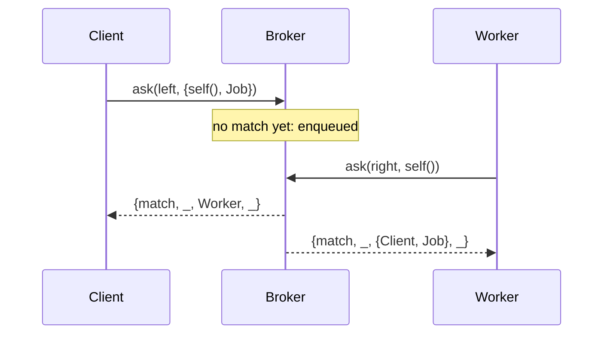

# cbroker

[](https://hex.pm/packages/cbroker)
[](https://github.com/g-andrade/cbroker/actions/workflows/ci.yml)
[](https://www.erlang.org)

Brokers for Erlang/OTP: processes on two lanes meet and swap offers, like in
worker pools and other producer-consumer setups. There is no broker process.
Matching runs in a NIF, concurrently on every online scheduler.

## What it strives for

- **No bottleneck process**: `cbroker` contends only on a few atomic counters
  and the rare global lock;
- **Offers are copied concurrently**, by the processes that match them.
- **Familiar model.** Offers (asks and bids), matches and drops follow
  [`sbroker`](https://hex.pm/packages/sbroker), which inspired it.

TODO: one benchmark figure against `cbroker_simple`.

## Installation

```erlang
{deps, [
    {cbroker, "~> 0.1"}
]}.
```

Building needs a C compiler: `cc`/`gcc` on Unix, and MSVC on Windows.

## Quick start

A worker pool. Clients offer jobs on the `left`; workers offer themselves on
the `right`.

```erlang
worker(Pool) ->
    {match, _, {Client, Job}, _} = cbroker:ask(Pool, right, self(), infinity),
    Client ! {self(), run(Job)},
    worker(Pool).

submit(Pool, Job) ->
    case cbroker:ask(Pool, left, {self(), Job}, 1_000) of
        {match, _, Worker, _} ->
            Mon = monitor(process, Worker),
            receive 
                {Worker, Result} -> {ok, Result} ;
                {'DOWN', Mon, _, _, _} -> {error, worker_stopped}
            end;

        {drop, Reason, _} ->
            {error, Reason}
    end.
```



## Asking

Every ask goes on a lane (`left` or `right`) and matches the roughly-oldest[*]
offer on the other lane. The variants differ in what happens when there is none
yet.

| Function        | If no match yet                                         |
|-----------------|---------------------------------------------------------|
| `ask`           | waits up to a timeout, then `{drop, timeout, _}`        |
| `nb_ask`        | returns `{drop, match_unavailable, _}` at once          |
| `dynamic_ask`   | returns `{await, Ticket}`; the reply arrives as a message |
| `async_ask`     | always returns `{await, Ticket}`, even if a match is available |
| `resumable_ask` | waits up to a timeout, then `{timeout, ReplyRef, Ticket}` and stays enqueued |

Asynchronous replies arrive as `{Tag, Reply}`, where `Tag` is either the
`Ticket` or a `ReplyRef` you pass in. `cancel(Ticket)` withdraws an enqueued
offer.

[*]: As requests are matched concurrently, the exact order is not
deterministic.

### Replies

- `{match, MatchRef, CounterOffer, SojournTime}`
- `{drop, Reason, SojournTime}`, with `Reason` one of:
  - `timeout`: `ask` gave up
  - `match_unavailable`: `nb_ask` found no match
  - `broker_overloaded`: skipped too many cancelled offers
  - `broker_closed`: the broker closed while you waited
  - `cancelled`: a concurrent process cancelled the request

`SojournTime` is the time spent enqueued, in nanoseconds.

## Named brokers

`cbroker:new/0,1` returns a reference; the broker lives as long as it is
referenced. With the option `depends_on_creator`, the broker closes when its
creator dies.

To give it a name and a place in your supervision tree:

```erlang
Children = [cbroker:child_spec({local, my_pool})],
%% ...
cbroker:ask(my_pool, left, Job).
```

Names take the same forms as OTP process names: 
* `{local, atom()}`, 
* `{global, term()}`, 
* or `{via, module(), term()}`.

## How it works

Each ask claims a cell in a shared array by atomically incrementing its lane's
tail, then comparing-and-swapping its offer in, or taking the offer already
there. 

Arrays are handed out in order from a mutex-guarded pool, and each scheduler
caches the ones it is using, so the lock is taken once per array rather than
once per ask.

TODO: structure diagram (broker → schedulers → batches → cells).

Details: [INTERNALS.md](INTERNALS.md).

## License

[MIT](LICENSE)
